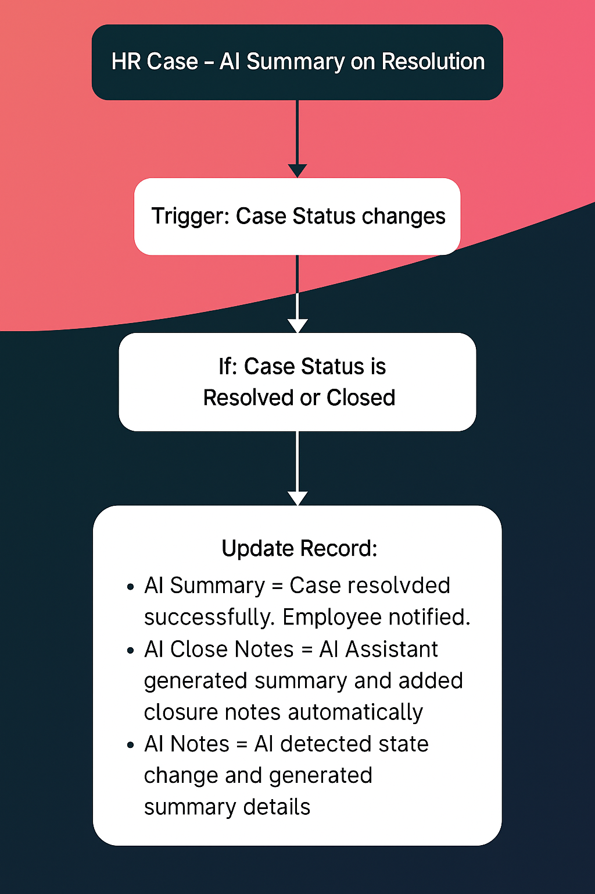

# ServiceNow_HRSD_Project2
# ServiceNow HRSD | GenAI HR Case Summary Assistant (Yokohama PDI)

## Overview
This project simulates **Generative AI** summarization for HR cases.  
When a case’s status changes to *Resolved* or *Closed*, Flow Designer automatically generates:
- **AI Summary** — short summary of the resolution
- **AI Close Notes** — description of closure details
- **AI Notes** — record of AI reasoning

## Flow Logic
1. **Trigger:** HR Case updated  
2. **If:** Case Status is Resolved or Closed  
3. **Then:** Update AI Summary, AI Close Notes, AI Notes  

## Highlights
- Uses **custom Case Status** field (to simulate HRSD State logic)  
- Demonstrates **AI summarization automation**  
- Fully built in **Flow Designer (no-code)**  
- Works on **Yokohama PDI** without licensed HR plugins  

## Diagram

## Outcome
HR cases automatically generate closing summaries and AI reasoning when resolved —  
showcasing **GenAI in HRSD** with smart case documentation.
